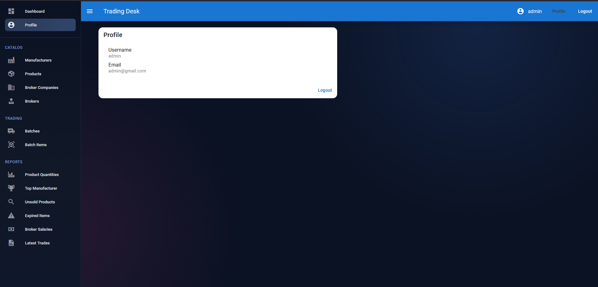
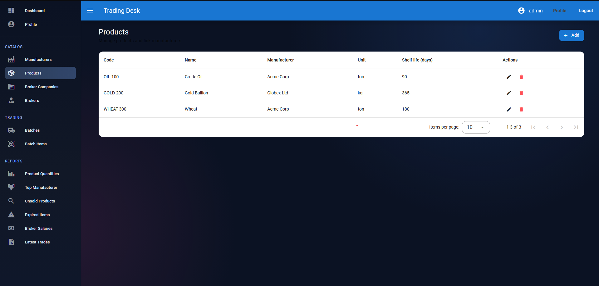
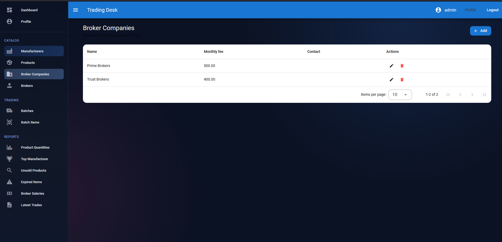
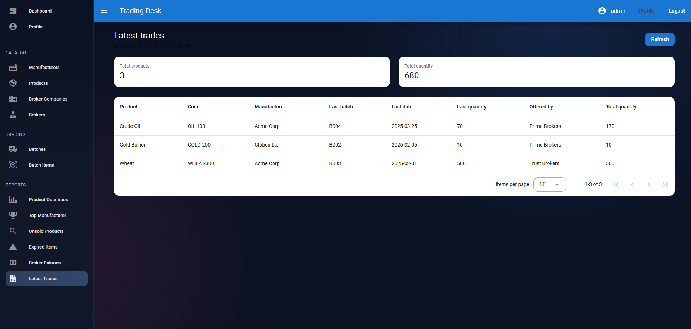

# Лабораторная работа №4 — Клиентская часть (Vue.js)

## Цель работы
Разработать SPA на Vue 3 для управления торговыми каталогами, партиями и отчётами, подключив его к API из предыдущей лабораторной работы.

## Технологии
- Vue.js 3 (Composition API) + TypeScript — основной фреймворк.
- Vuetify 3 — UI (Material Design), @mdi/font + Roboto.
- Pinia — состояние и хранение токена с инициализацией при старте.
- Vue Router — маршруты с гардом авторизации и проверкой `requiresAdmin`.
- Axios — HTTP-клиент, токен кладётся в `Authorization: Token <token>`, на 401 вызывается обработчик выхода.
- Vite — сборка и dev-сервер.

## Запуск проекта
- Бэкенд: должен быть доступен по `VITE_API_BASE_URL` (по умолчанию `http://127.0.0.1:8000/`), CORS включён.
- Фронтенд: `npm install`, затем `npm run dev` (http://localhost:5173/).

## Реализация интерфейса
1. Авторизация и регистрация (`/login`, `/register`): формы входа/регистрации, токен сохраняется в Pinia, при отсутствии токена приватные маршруты редиректят на логин, admin-страницы недоступны не-админам.

2. Дашборд (`/`): стартовый экран после входа.

3. Каталоги (admin): `/catalog/manufacturers`, `/products`, `/broker-companies`, `/brokers` — таблицы Vuetify с CRUD-формами и удалением через диалоги.

4. Торговля: `/trading/batches`, `/batch-items` — список партий и позиций, диалоги создания/редактирования, удаление с подтверждением. Для обычного брокера поле брокера фиксируется на его ID; админ выбирает брокера из списка.

5. Отчёты: 
   - `product-quantities` — остатки на дату,
   - `top-manufacturer` — лучший производитель за период,
   - `unsold-products` — непроданные по компании,
   - `expired-items` — просроченные позиции,
   - `broker-salaries` — зарплаты брокеров (фильтры по компании/датам),
   - `latest-trades` — последние сделки и итоги.

6. Профиль (`/profile`): данные пользователя, просмотр/редактирование.

## API и данные
`src/api/http.ts` — базовый Axios-клиент; подставляет токен, ловит 401 для выхода. `baseURL` берётся из `VITE_API_BASE_URL`.

`src/api/trading.ts` — вызовы для каталогов, партий и отчётов: CRUD для manufacturers/products/broker-companies/brokers/batches/batch-items; отчёты (product-quantities, top-manufacturer, unsold-products, expired-items, broker-salaries, latest-trades).

## Скриншоты

